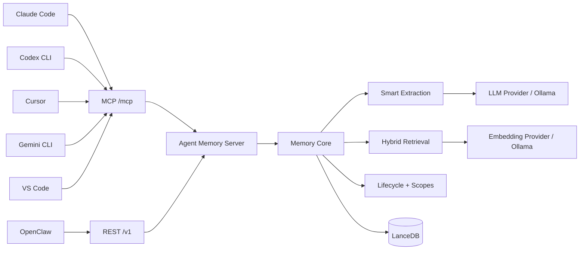

<div align="center">

# 🧠 Agent Memory

### One memory. Every agent.

**A self-hosted long-term memory layer shared by Claude Code, Codex CLI, Cursor, Gemini CLI, VS Code agents, OpenClaw, and any MCP-capable client.**

[](https://github.com/Masikomoore/agent-memory/actions/workflows/ci.yml)
[](LICENSE)
[](docs/AGENT_CLIENTS.md)
[](https://lancedb.com/)

[Quick Start](#quick-start) · [Connect Agents](docs/AGENT_CLIENTS.md) · [Architecture](#architecture) · [Roadmap](ROADMAP.md) · [Contributing](CONTRIBUTING.md) · [中文](README_CN.md)

</div>

---

## Your agents should not have separate memories

Most AI tools remember in isolation. Claude Code learns something, Codex starts from zero. Cursor discovers a project convention, Gemini CLI never sees it. Switching tools means repeating yourself.

Agent Memory gives them **one private, continuously maintained memory service**:

```text
Claude Code ─┐
Codex CLI ───┤
Cursor ──────┤
Gemini CLI ──┼──► Agent Memory Server ─► Memory Core ─► LanceDB
VS Code ─────┤          MCP + REST        │
OpenClaw ────┘                            ├─ extraction
                                         ├─ hybrid retrieval
                                         ├─ decay / reinforcement
                                         └─ scopes / lifecycle
```

Your agents call the memory service. **The memory service—not a specific IDE or agent—owns the long-term memory.**

## Why Agent Memory?

| | Agent Memory |
|---|---|
| **Shared across tools** | One memory backend for independent agents and IDEs |
| **Automatic** | Agents recall and capture durable context without hand-editing a knowledge base |
| **Self-hosted** | Run locally, on a homelab, LAN, VPN, or private server |
| **Protocol-first** | Streamable HTTP MCP for agents + REST for integrations |
| **Durable** | LanceDB persistence with hybrid semantic/keyword retrieval |
| **Memory lifecycle** | Extraction, deduplication, decay, reinforcement, tiering, and scope controls |
| **Provider-flexible** | OpenAI-compatible embedding/LLM APIs or local Ollama |
| **No knowledge graph required** | Deliberately focused on durable agent memory, not graph administration |

## Real cross-agent proof

This is not only an MCP configuration demo. A real acceptance test has already verified the core promise:

> **Claude Code captured a durable fact → a separate Codex CLI session recalled the same fact from shared global memory.**

Current integration status:

| Client | Integration | Status |
|---|---|---|
| Claude Code | Streamable HTTP MCP | ✅ real-environment verified |
| Codex CLI | Streamable HTTP MCP | ✅ real-environment verified |
| OpenClaw | REST remote-memory mode | ✅ automated integration coverage |
| Cursor | Streamable HTTP MCP | 🧩 config template ready |
| Gemini CLI | Streamable HTTP MCP | 🧩 config template ready |
| VS Code agents | Streamable HTTP MCP | 🧩 config template ready |
| Any MCP client | `/mcp` | 🧩 protocol-compatible |

See [docs/AGENT_CLIENTS.md](docs/AGENT_CLIENTS.md) for client configuration.

## Architecture



The important boundary is the server: clients never open their own competing databases. They share one authoritative memory plane.

## Quick Start

### Option 1 — Docker + local Ollama

Requirements: Docker Compose and an x86_64/arm64 host supported by LanceDB.

```bash
git clone https://github.com/Masikomoore/agent-memory.git
cd agent-memory
cp .env.example .env

# Put a long random value in MEMORY_SERVER_TOKEN.
# Example generator:
openssl rand -hex 32

docker compose up -d
curl http://127.0.0.1:7337/health
```

The default compose stack uses:

- `nomic-embed-text` for embeddings
- `qwen2.5:3b` for SmartExtractor
- persistent volumes for LanceDB and Ollama models
- loopback-only host publishing by default

Then connect an MCP client to:

```text
http://127.0.0.1:7337/mcp
```

with:

```text
Authorization: Bearer <MEMORY_SERVER_TOKEN>
```

### Option 2 — Run the server directly

```bash
npm ci
npm run build

export MEMORY_EMBEDDING_API_KEY="..."
export MEMORY_EMBEDDING_MODEL="text-embedding-3-small"
export MEMORY_LLM_API_KEY="..."
export MEMORY_LLM_MODEL="your-model"
export MEMORY_SERVER_TOKEN="replace-with-a-long-random-secret"

npm run memory-server
```

For LAN/WAN binding, Host/Origin allowlists, REST examples, and provider configuration, see [docs/MEMORY_SERVER.md](docs/MEMORY_SERVER.md).

## How agents should use it

Giving an agent MCP access is only half the integration. The agent also needs a durable behavior rule:

1. **Recall** before answering when prior decisions, preferences, project state, people, recurring entities, or historical context may matter.
2. **Capture** after a durable preference, decision, constraint, fact, or project state is established.
3. Send a stable logical `agentId` such as `claude-code`, `codex`, or `cursor`.
4. Never store passwords, API keys, auth tokens, or transient command output.
5. Current user instructions always override recalled memory.

Reusable instructions and client examples live in [`examples/mcp-clients`](examples/mcp-clients).

## Memory model

Agent Memory is designed around a simple idea: **memory is infrastructure, not a chat transcript archive**.

The server combines:

- semantic embeddings
- BM25/full-text signals
- retrieval fusion and reranking
- smart extraction of durable facts
- deduplication and supersession
- time decay and access reinforcement
- memory tiers and lifecycle maintenance
- global, agent, user, and project scopes
- canonical-memory compatibility for OpenClaw adapters

The standalone server keeps those capabilities independent from any one host application's lifecycle.

## Deployment

Agent Memory is intended to run as a small private service. Common deployment targets:

- local workstation
- home server / NAS
- private LAN or VPN
- Coolify / Docker host
- small cloud VM behind TLS and authentication

See [docs/DEPLOY_COOLIFY.md](docs/DEPLOY_COOLIFY.md) for Coolify guidance.

> **Security default:** the server listens on loopback unless configured otherwise. Non-loopback mode requires a Bearer token and explicit Host allowlisting.

## Project status

**Alpha / early community release.** The shared-memory architecture and Claude Code ↔ Codex interoperability have been proven, but the public project is still being separated into cleaner server/core/adapter packages.

Good areas for contributors right now:

- more real-client acceptance tests
- memory inspection / administration UI
- stronger multi-user authentication and ACLs
- backup / restore UX
- observability and metrics
- deployment templates
- additional agent adapters
- benchmark and memory-quality evaluation

See the full [Roadmap](ROADMAP.md).

## Contributing

This project is intentionally being opened early. If the idea of a **personal memory layer that survives agent switching** is useful to you, there are several valuable ways to help:

- ⭐ Star the project so other agent-tool users can find it
- 🧪 Test it with your agent stack and report what breaks
- 🔌 Add an adapter or verified client recipe
- 🧠 Improve memory quality, retrieval, or lifecycle behavior
- 🔐 Improve authentication, tenancy, backup, or operations
- 📖 Fix docs where setup is confusing

Start with [CONTRIBUTING.md](CONTRIBUTING.md). Small, focused pull requests are welcome.

## Philosophy

- **One owner for memory.** Agents are clients; the memory service is authoritative.
- **Automatic by default.** Humans should not need to curate every memory manually.
- **Private first.** Self-hosting and local-network deployment are first-class use cases.
- **Interoperable.** MCP and REST are boundaries; no single agent vendor owns the data plane.
- **Useful forgetting matters.** Long-term memory needs lifecycle management, not infinite accumulation.
- **No graph ceremony.** A knowledge graph should not be required just to remember what matters.

## License & provenance

Agent Memory is released under the [MIT License](LICENSE).

The independent server, remote-client architecture, MCP integration, deployment work, and public project organization in this repository are maintained as **Agent Memory**. Portions of the underlying memory engine were adapted from the MIT-declared `memory-lancedb-pro` codebase. See [THIRD_PARTY_NOTICES.md](THIRD_PARTY_NOTICES.md) for provenance and attribution.

This repository is published as an independent project with its own history and release process; it is not a GitHub fork and does not depend on an upstream Git remote.

---

<div align="center">

**If you switch between AI agents, your memory shouldn't reset with the tool.**

⭐ Star · 🐛 Report · 🔧 Contribute · 🧠 Remember

</div>
