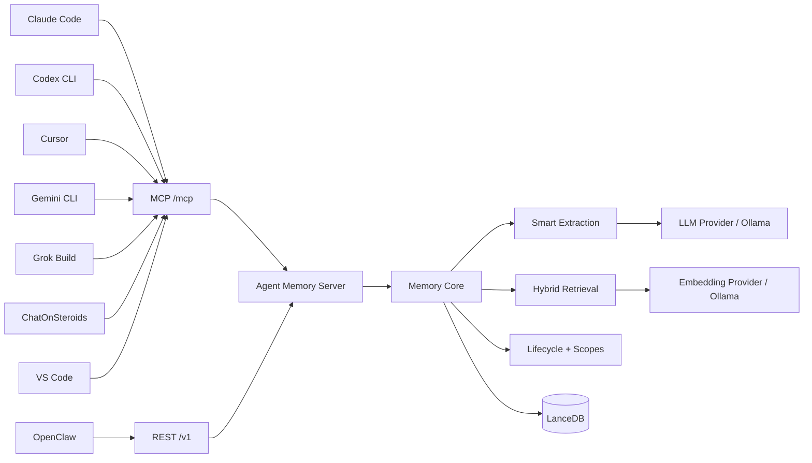

<div align="center">

# 🧠 Agent Memory

### One memory. Every agent.

**A self-hosted long-term memory layer shared by Claude Code, Codex CLI, Cursor, Gemini CLI, Grok Build, ChatOnSteroids, VS Code agents, OpenClaw, and any MCP-capable client.**

[](https://github.com/Masikomoore/agent-memory/actions/workflows/ci.yml)
[](LICENSE)
[](docs/AGENT_CLIENTS.md)
[](https://lancedb.com/)
[](https://github.com/Masikomoore/agent-memory/stargazers)

[Quick Start](#quick-start) · [Connect Agents](docs/AGENT_CLIENTS.md) · [Architecture](#architecture) · [Roadmap](ROADMAP.md) · [Contributing](CONTRIBUTING.md) · [Discussions](https://github.com/Masikomoore/agent-memory/discussions) · [中文](README_CN.md)

</div>

---

> [!TIP]
> **If you use more than one AI coding agent, Agent Memory is for you.** Star the repository if you want an open, self-hosted memory layer that stays with *you* instead of one vendor, IDE, or model.

## Why I built this

Agent Memory started with a painful lesson: my Codex Pro account was suspended, and I discovered that I had never kept a complete copy of my history. The local Codex project files were still on my machine, but some browser conversations, planning discussions, and the back-and-forth that shaped development decisions were simply gone.

It was the first time I had personally experienced what losing access to an AI account could mean. I use products from nearly every major AI company—Claude, Codex, Grok, Gemini, and others—and that immediately made the problem feel much bigger than one account. If each agent keeps the only copy of part of my working memory, then changing tools, losing an account, or having a service disappear can also erase part of the history behind my projects.

So I built **Agent Memory** as an independent memory layer that does not belong to any of those agent IDEs or CLIs. Today I use it across Claude Code, Codex CLI, Grok Build, and Gemini CLI, with one shared memory service behind them. The experience has been smooth enough that I am publishing it for other people who regularly use **two or more agents** and want their long-term working memory to stay under their own control.

## Your agents should not have separate memories

Most AI tools remember in isolation. Claude Code learns something, Codex starts from zero. Cursor discovers a project convention, Gemini CLI never sees it. Switching tools means repeating yourself.

Agent Memory gives them **one private, continuously maintained memory service**:

```text
Claude Code ─┐
Codex CLI ───┤
Cursor ──────┤
Gemini CLI ──┼──► Agent Memory Server ─► Memory Core ─► LanceDB
Grok Build ──┤          MCP + REST        │
ChatOnSteroids┤                           ├─ extraction
VS Code ─────┤                            │
OpenClaw ────┘                            │
                                         ├─ hybrid retrieval
                                         ├─ decay / reinforcement
                                         └─ scopes / lifecycle
```

Your agents call the memory service. **The memory service—not a specific IDE or agent—owns the long-term memory.**

### The 30-second version

| Today | With Agent Memory |
|---|---|
| Every agent starts with a different history | Agents recall from one authoritative memory plane |
| Important decisions live in chat transcripts | Durable facts are extracted into retrievable memory |
| Switching tools means repeating context | Claude Code, Codex, Cursor, Gemini CLI, Grok Build, ChatOnSteroids, VS Code, and OpenClaw can share it |
| Memory is tied to a vendor or local plugin | Memory runs as your own MCP/REST service |
| "Remember everything" becomes noisy over time | Decay, reinforcement, deduplication, tiers, and scopes manage lifecycle |

**Who should try it now?** Developers and small teams who already switch between multiple AI agents, prefer self-hosting, and want shared memory without maintaining a knowledge graph.

## Why Agent Memory?

| | Agent Memory |
|---|---|
| **Shared across tools** | One memory backend for independent agents and IDEs |
| **Automatic** | Agents recall and capture durable context without hand-editing a knowledge base |
| **Self-hosted** | Run locally, on a homelab, LAN, VPN, or private server |
| **Protocol-first** | Streamable HTTP MCP for agents + REST for integrations |
| **Durable** | LanceDB persistence with hybrid semantic/keyword retrieval |
| **Memory lifecycle** | Extraction, deduplication, decay, reinforcement, tiering, and scope controls |
| **Provider-flexible** | OpenAI-compatible embedding/LLM APIs or local Ollama |
| **No knowledge graph required** | Deliberately focused on durable agent memory, not graph administration |

## Real cross-agent proof

This is not only an MCP configuration demo. A real acceptance test has already verified the core promise:

> **Real acceptance has verified Claude Code → Codex recall, and a separate Codex capture → Claude Code + Grok recall through the same shared memory service.**

Current integration status:

| Client | Integration | Status |
|---|---|---|
| Claude Code | Streamable HTTP MCP | ✅ real-environment verified |
| Codex CLI | Streamable HTTP MCP | ✅ real-environment verified |
| Grok Build | Streamable HTTP MCP | ✅ real-environment verified |
| ChatOnSteroids | Streamable HTTP MCP via Plugins | ✅ real-environment verified |
| OpenClaw | REST remote-memory mode | ✅ automated integration coverage |
| Cursor | Streamable HTTP MCP | 🧩 config template ready |
| Gemini CLI | Streamable HTTP MCP | ✅ authenticated MCP transport verified |
| VS Code agents | Streamable HTTP MCP | 🧩 config template ready |
| Any MCP client | `/mcp` | 🧩 protocol-compatible |

See [docs/AGENT_CLIENTS.md](docs/AGENT_CLIENTS.md) for client configuration.

## Architecture



The important boundary is the server: clients never open their own competing databases. They share one authoritative memory plane.

## Quick Start

### Easiest path — ask your AI agent to do it

Already using Claude Code, Codex, Grok, Gemini, ChatOnSteroids, Cursor, or another coding agent? Copy [`examples/mcp-clients/agent-install-prompt.md`](examples/mcp-clients/agent-install-prompt.md) into that agent. It tells the agent to inspect your machine, preserve existing configuration, deploy or connect Agent Memory, configure the clients it finds, keep credentials out of repositories/chat history, and verify the real capture/recall path before declaring success.

### Option 1 — Docker + your providers

Requirements: Docker Compose and an x86_64/arm64 host supported by LanceDB.

```bash
git clone https://github.com/Masikomoore/agent-memory.git
cd agent-memory
cp .env.example .env

# Put a long random value in MEMORY_SERVER_TOKEN.
# Example generator:
openssl rand -hex 32

docker compose up -d
curl http://127.0.0.1:7337/health
```

The default compose stack uses:

- your configured OpenAI-compatible embedding provider
- your configured OpenAI-compatible SmartExtractor LLM provider
- a persistent volume for LanceDB
- loopback-only host publishing by default

If you prefer an all-local Ollama stack, use the optional overlay:

```bash
docker compose -f docker-compose.yaml -f docker-compose.ollama.yaml up -d
```

Model names are still operator-selected; the overlay only supplies and
bootstraps the local Ollama runtime.

Then connect an MCP client to:

```text
http://127.0.0.1:7337/mcp
```

with:

```text
Authorization: Bearer <MEMORY_SERVER_TOKEN>
```

### Option 2 — Run the server directly

```bash
npm ci
npm run build

export MEMORY_EMBEDDING_API_KEY="..."
export MEMORY_EMBEDDING_MODEL="text-embedding-3-small"
export MEMORY_LLM_API_KEY="..."
export MEMORY_LLM_MODEL="your-model"
export MEMORY_SERVER_TOKEN="replace-with-a-long-random-secret"

npm run memory-server
```

For LAN/WAN binding, Host/Origin allowlists, REST examples, and provider configuration, see [docs/MEMORY_SERVER.md](docs/MEMORY_SERVER.md).

## How agents should use it

Giving an agent MCP access is only half the integration. The agent also needs a durable behavior rule:

1. **Recall** before answering when prior decisions, preferences, project state, people, recurring entities, or historical context may matter.
2. **Capture** after a durable preference, decision, constraint, fact, or project state is established.
3. Send a stable logical `agentId` such as `claude-code`, `codex`, or `cursor`.
4. Never store passwords, API keys, auth tokens, or transient command output.
5. Current user instructions always override recalled memory.

Reusable instructions and client examples live in [`examples/mcp-clients`](examples/mcp-clients).

## Memory model

Agent Memory is designed around a simple idea: **memory is infrastructure, not a chat transcript archive**.

The server combines:

- semantic embeddings
- BM25/full-text signals
- retrieval fusion and reranking
- smart extraction of durable facts
- deduplication and supersession
- time decay and access reinforcement
- memory tiers and lifecycle maintenance
- global, agent, user, and project scopes
- canonical-memory compatibility for OpenClaw adapters

The standalone server keeps those capabilities independent from any one host application's lifecycle.

## Deployment

Agent Memory is intended to run as a small private service. Common deployment targets:

- local workstation
- home server / NAS
- private LAN or VPN
- Coolify / Docker host
- small cloud VM behind TLS and authentication

See [docs/DEPLOY_COOLIFY.md](docs/DEPLOY_COOLIFY.md) for Coolify guidance.

> **Security default:** the server listens on loopback unless configured otherwise. Non-loopback mode requires a Bearer token and explicit Host allowlisting.

## Project status

**Alpha / early community release.** The shared-memory architecture and Claude Code ↔ Codex interoperability have been proven, but the public project is still being separated into cleaner server/core/adapter packages.

Good areas for contributors right now:

- more real-client acceptance tests
- memory inspection / administration UI
- stronger multi-user authentication and ACLs
- backup / restore UX
- observability and metrics
- deployment templates
- additional agent adapters
- benchmark and memory-quality evaluation

See the full [Roadmap](ROADMAP.md).

### What we want help with right now

You do **not** need to understand the memory engine to contribute. The highest-value community work today is concrete and testable:

| Area | Good contribution |
|---|---|
| Agent integrations | Verify Cursor/VS Code against a real server, or complete Gemini's model-authenticated agent-level acceptance path |
| Operations | Improve backup/restore, diagnostics, metrics, Docker, NAS, or Coolify workflows |
| Memory quality | Reproduce a bad recall/capture case with a small fixture and expected behavior |
| Security | Improve client identity, ACLs, token rotation, and safe remote deployment |
| UX | Prototype a small memory inspection/search/admin interface |
| Docs | Make one setup path reproducible for someone who has never used the project |

Look for [`good first issue`](https://github.com/Masikomoore/agent-memory/labels/good%20first%20issue) and [`help wanted`](https://github.com/Masikomoore/agent-memory/labels/help%20wanted), or start a [Discussion](https://github.com/Masikomoore/agent-memory/discussions) before a larger design change.

## Contributing

This project is intentionally being opened early. If the idea of a **personal memory layer that survives agent switching** is useful to you, there are several valuable ways to help:

- ⭐ Star the project so other agent-tool users can find it
- 🧪 Test it with your agent stack and report what breaks
- 🔌 Add an adapter or verified client recipe
- 🧠 Improve memory quality, retrieval, or lifecycle behavior
- 🔐 Improve authentication, tenancy, backup, or operations
- 📖 Fix docs where setup is confusing

Start with [CONTRIBUTING.md](CONTRIBUTING.md). Small, focused pull requests are welcome.

Consistent contributors are also welcome to help with **issue triage, client verification, documentation review, and roadmap shaping**. The goal is to grow Agent Memory as a community-maintained interoperability layer, not a one-person integration dump.

## Philosophy

- **One owner for memory.** Agents are clients; the memory service is authoritative.
- **Automatic by default.** Humans should not need to curate every memory manually.
- **Private first.** Self-hosting and local-network deployment are first-class use cases.
- **Interoperable.** MCP and REST are boundaries; no single agent vendor owns the data plane.
- **Useful forgetting matters.** Long-term memory needs lifecycle management, not infinite accumulation.
- **No graph ceremony.** A knowledge graph should not be required just to remember what matters.

## License & provenance

Agent Memory is released under the [MIT License](LICENSE).

The independent server, remote-client architecture, MCP integration, deployment work, and public project organization in this repository are maintained as **Agent Memory**. Portions of the underlying memory engine were adapted from the MIT-declared `memory-lancedb-pro` codebase. See [THIRD_PARTY_NOTICES.md](THIRD_PARTY_NOTICES.md) for provenance and attribution.

This repository is published as an independent project with its own history and release process; it is not a GitHub fork and does not depend on an upstream Git remote.

---

<div align="center">

**If you switch between AI agents, your memory shouldn't reset with the tool.**

⭐ Star · 🐛 Report · 🔧 Contribute · 🧠 Remember

</div>
